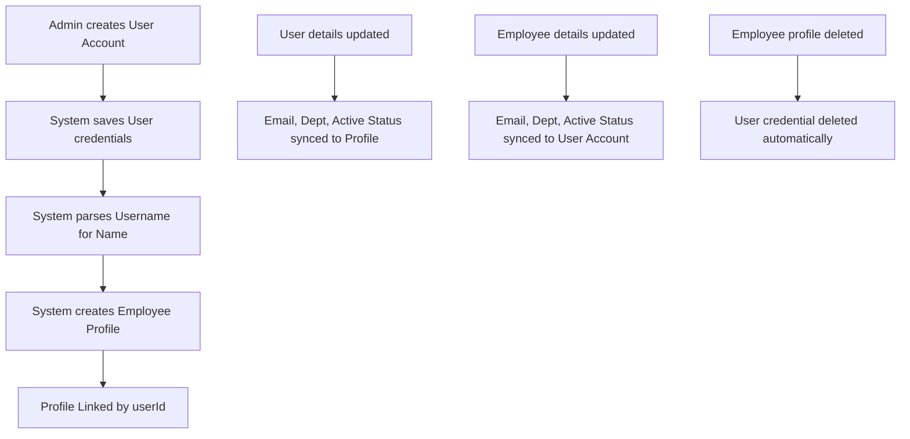
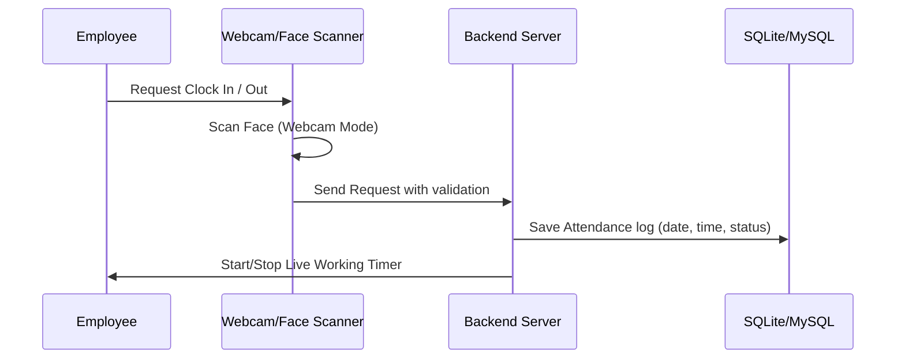
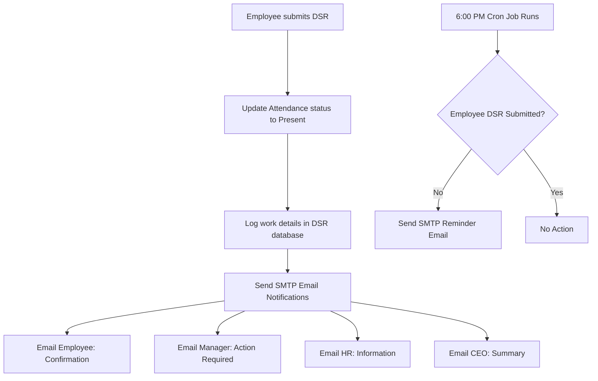

# HBEONLABS - Employee Work Management System

A state-of-the-art, full-stack enterprise platform for employee workflow automation, attendance tracking (with webcam scanning and biometric sync), Daily Status Reports (DSR), task management, and project tracking.

---

## 🔄 Complete Workflows & System Flows

The application orchestrates the following core operational flows:

### 1. Account Provisioning & Sync Flow

The system maintains a strict **1-to-1 relationship** between credentials (`User` table) and profile details (`Employee` table).



- **Unified Creation**: Creating a User Account under **User Settings** automatically creates a linked Employee Profile with parsed name parts.
- **Bi-directional Synchronisation**: Any edits to `email`, `departmentId`, or active status (`active`/`status`) instantly sync between User and Employee records.
- **Cascading Cleanup**: Deleting an Employee profile automatically purges their login credentials to keep the database clean and orphan-free.

---

### 2. Role-Based Access Control (RBAC) Flow

The system customises both frontend views (sidebar and page components) and backend query responses based on four user roles:

| Role | Designation | Permissions & Access Scope |
|---|---|---|
| **SUPER_ADMIN** | CEO / Owner | **Full Global Access**: Can create/manage user accounts, edit departments, view all project/task boards, post global announcements, and run database settings. |
| **ADMIN** | HR Manager | **Human Resources & Directory**: Can view and manage all employee profiles, check overall attendance lists, review leaves, approve DSRs, and export attendance spreadsheets. |
| **MANAGER** | Tech Lead / Head | **Team Oversight**: Sees only tasks, DSRs, projects, and attendance records corresponding to their direct reports (where `managerId = manager's userId`) and themselves. |
| **EMPLOYEE** | Developer / Designer | **Self Access Only**: Can clock in/out, view assigned projects, update tasks, submit their own DSR, and request leaves. Cannot view others' private logs. |

---

### 3. Attendance & Biometric Integration Flow



- **Webcam Check-In**: Captures check-in and check-out logs using browser-based face scanning.
- **Biometric eSSL Sync**: Integrates with external eSSL Biometric machines over local sockets (ports `4370`), auto-parsing biometric logs.
- **Live Session Timer**: Displays a ticking real-time duration clock on the dashboard while checked in.

---

### 4. Daily Status Report (DSR) & SMTP Mail Flow

DSRs sync daily progress, verify working hours, and notify the management chain.



- **Attendance Sync**: Submitting a DSR automatically updates today's attendance status to **Present** and recalculates daily working hours.
- **Real-Time SMTP Alerting**: Sends confirmation logs to the Employee, review alerts to their Manager, and overview logs to HR and the CEO.
- **Auto-reminders**: A background cron-job checks DSR submissions daily at 6:00 PM and emails a warning notice to employees who missed logging their DSR.

---

## 📁 Project Structure

```
├── app/                          # Next.js 16 Frontend (App Router)
│   ├── (auth)/                   # Authentication pages (Login)
│   ├── (dashboard)/              # Protected dashboard screens
│   │   ├── attendance/           # Clock in/out & history
│   │   ├── dashboard/            # Home metrics for all roles
│   │   ├── departments/          # Department listings
│   │   ├── dsr/                  # Daily Status Reports
│   │   ├── employees/            # Employee directory
│   │   ├── hr-finance/           # Payslips, recruitment, appraisals
│   │   ├── leaves/               # Leave request tracker
│   │   ├── profile/              # User settings
│   │   ├── projects/             # Project portfolios
│   │   ├── system-settings/      # Admin panels & announcements
│   │   ├── tasks/                # Tasks list & assignments
│   │   ├── team/                 # Manager team board
│   │   └── users/                # User account controller
│   ├── layout.tsx                # Context Provider & layout wrapper
│   └── globals.css               # Design tokens & styles
├── components/                   # React UI Components
│   └── layout/                   # Sidebar, Header, Chatbot Assistant
├── lib/                          # Utility & Networking Libraries
│   ├── api-client.ts             # Axios backend connector
│   ├── auth-context.tsx          # JWT state manager
│   └── types.ts                  # Shared TS typings
├── server/                       # Express Node.js Backend
│   ├── config/                   # Sequelize DB connection details
│   ├── models/                   # DB Models (User, Employee, DSR, etc.)
│   ├── routes/                   # REST Endpoints
│   ├── controllers/              # Core business rules
│   ├── middleware/               # Auth & Role checkers
│   ├── utils/                    # Password hashing & Nodemailer
│   └── server.js                 # App core start script
```

---

## 🛠️ Installation & Setup

### 1. Prerequisites
- **Node.js**: v18.0+
- **pnpm**: installed globally (`npm i -g pnpm`)
- **Database**: MySQL 8.0+ (Fallback to SQLite is fully automated if MySQL is unavailable)

### 2. Configure Environment Variables
Create a `.env` file in the root directory:

```env
# Database Credentials
DB_HOST=localhost
DB_PORT=3306
DB_NAME=hbeonlabs_db
# Falls back automatically to SQLite if these fail:
DB_USER=root
DB_PASSWORD=your_password
DB_DIALECT=mysql
DB_STORAGE=./database.sqlite

# Backend API Settings
PORT=5001
NODE_ENV=development

# Authentication (JWT)
JWT_SECRET=super_secret_key_change_in_production
JWT_EXPIRY=7d

# Frontend Connection
NEXT_PUBLIC_API_URL=http://localhost:5001/api

# SMTP Email Configuration (Gmail App Password shown below)
SMTP_HOST=smtp.gmail.com
SMTP_PORT=587
SMTP_SECURE=false
SMTP_USER=your_corporate_email@gmail.com
SMTP_PASS=abcd efgh ijkl mnop
```

> [!NOTE]
> If SMTP configurations are omitted, email logs are printed to the server terminal instead.

### 3. Deploy Dependencies & Database Setup
```bash
# Install dependencies
pnpm install

# Seed the database (Creates tables, mock users, departments, and designations)
pnpm seed
```

### 4. Running the Development Server
```bash
# Starts both frontend and backend concurrently
pnpm dev
```
- **Frontend Panel**: `http://localhost:3000`
- **Backend API**: `http://localhost:5001/api`

---

## 🔑 Demo Credentials

Once the database has been seeded, use the following credentials for testing:

| Username | Password | Role | Main Screen Access |
|---|---|---|---|
| **superadmin** | `Hbeonlabs@2026` | SUPER_ADMIN (CEO) | Full access, user accounts, system configuration |
| **admin** | `Hbeonlabs@2026` | ADMIN (HR Manager) | Employee directory, leave approval, payslips |
| **manager** | `Hbeonlabs@2026` | MANAGER (Tech Lead) | Team tasks, team attendance, DSR review |
| **employee** | `Hbeonlabs@2026` | EMPLOYEE (Staff) | Self tasks, personal attendance, apply leave |
